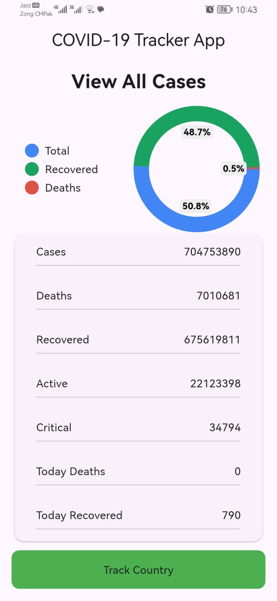
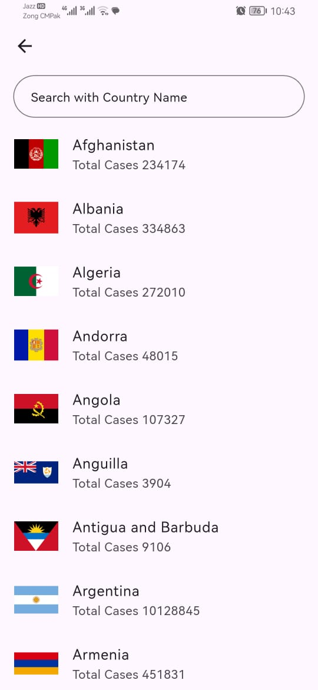
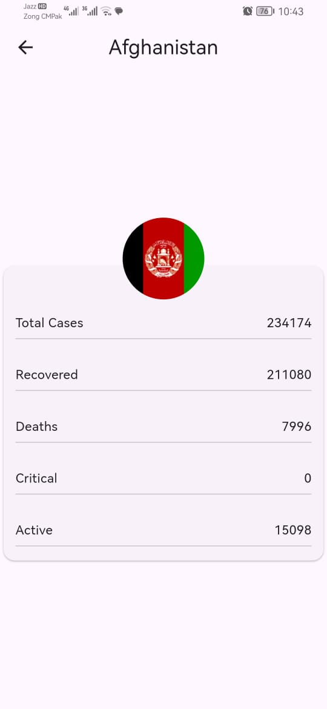

<h1 align="center">🦠 COVID-19 Tracker App</h1>
<p align="center">
  A Flutter-based mobile application that shows live COVID-19 statistics with country-wise details and clean, modern UI.
</p>


---

## 🚀 Features
- 🌍 **Live statistics** via REST API  
- 📊 **Country-wise breakdown** (cases, recoveries, deaths)  
- 📈 **Charts/visualization** for trends  
- 📱 **Responsive & modern UI**  
- ⚡ Smooth performance & simple state handling  

---

## 📸 Screenshots

<p align="center">
  <table>
    <tr>
      <td align="center"><strong>Home</strong></td>
      <td align="center"><strong>Detail</strong></td>
      <td align="center"><strong>Country View</strong></td>
    </tr>
    <tr>
      <td></td>
      <td></td>
      <td></td>
    </tr>
  </table>
</p>

---

## 🛠 Tech Stack
- **Flutter** (Dart)
- **HTTP** for API calls
- **Chart/Graph package** (e.g., `fl_chart` or similar)
- **State management:** simple setState / Provider (your choice)

---

## 📦 Installation

1. **Clone the repository**
   ```bash
   git clone https://github.com/ranakashifhussain5/covid19-tracker.git
   cd covid19-tracker
